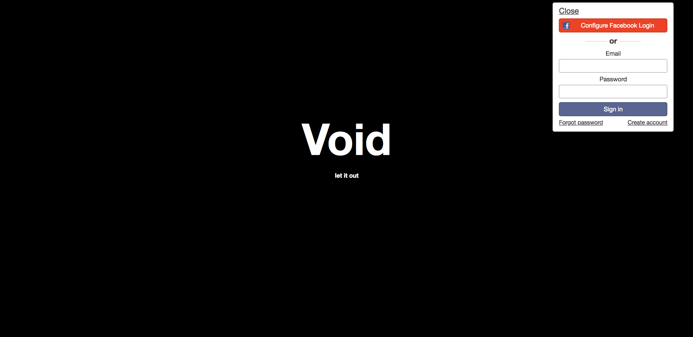
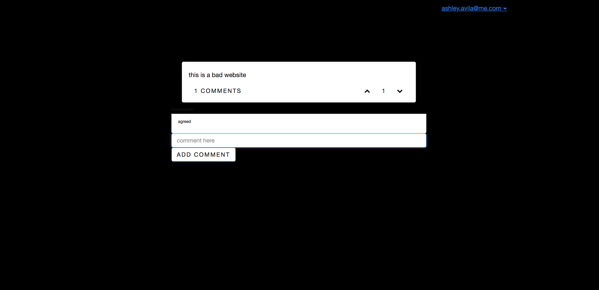

# void-app
A frontend/backend project made to revive Yik Yak.

Made using Meteor, I was able to make a Yik Yak clone. You must be logged in to see the feed and send messages/comment.

This app uses Meteor JS conventions.

# Use Instructions
1. Fork and clone repo
2. Install Meteor.JS for OSX/Linux with command: curl https://install.meteor.com/ | sh
3. Open repo on command line
4. Run command: meteor
